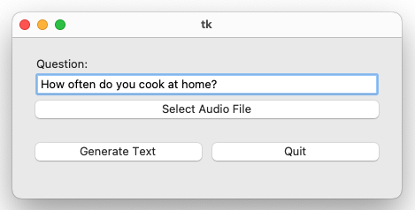

# AI-powered Speaking Test Prep Assistant App

It transcribes the audio record of your answer, revises and enhances it and generates a text file containing both your answer and AI-enhanced answer.
I built it to streamline my IELTS speaking test preparation workflow.

## How to Use

### Step 1: Create an OpenAI account and API key

Follow this guide to complete the step before moving on.<br>
*Please note that usage of OpenAI APIs is subject to a fee. For more information, check out its [pricing](https://openai.com/api/pricing/).*

### Step 2: Clone this repo
```
git clone git@github.com:mrjwei/medium-toc-generator.git
cd medium-toc-generator
```

### Step 3: Create venv and install dependencies
```
python3 -m venv app-env
source app-env/bin/activate
pip install -r requirements.txt
```

### Step 4: Run programme
```
python main.py
```
This will open a GUI.



### Step 5: Just speak, record and let tha app take care of the rest!
Enter the question, select the recorded audio and hit *Generate Text*. A `.txt` file will be generated in your working directory.
